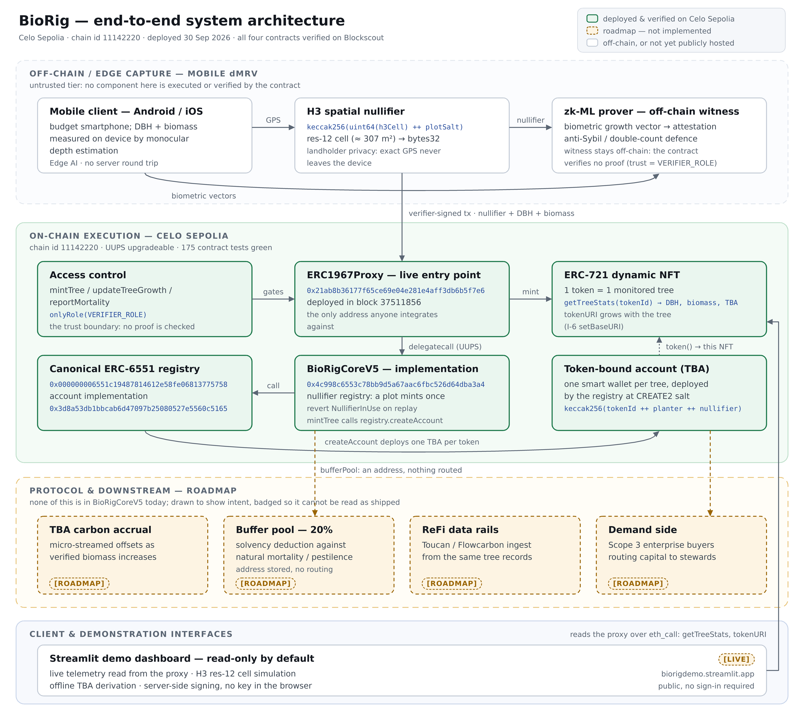

# BioRig

`BioRigCoreV5` is an upgradeable (UUPS) ERC-721 where one token is one planted, monitored tree. Every mint
carries a 32-byte spatial nullifier, so the same plot cannot be registered twice, and every tree gets an
ERC-6551 token-bound account created through the canonical registry.

**Project lead, author and sole deployer: Adam Jannoud** ([@AdamJannoud](https://github.com/AdamJannoud)). The
contract, the tooling, the tests and these documents are his work, and every deployment recorded below was broadcast by
him from a deployer key he controls. Commits in this repository are authored by that account.

**Live on Celo mainnet** (chain id `42220`) since 1 October 2026: one broadcast, four transactions, 4,015,198 gas at
200.0011 gwei, so **0.803044 CELO**, all four in block `78935900` with every receipt successful. The canonical ERC-6551
registry was already on the chain, so it was reused rather than deployed. All four addresses are verified on Blockscout.

| contract | address |
| --- | --- |
| BioRigCoreV5 (implementation) | `0xdb3a450b85D48E6e6552dB2b32aD75a7ac590c60` |
| ERC1967Proxy (the live address) | `0x04Db169dDF8AbB80943161C01B2a71DC40384E64` |
| ERC-6551 account implementation | `0x65D18C960170ca2B4936c62945bA0e827e5cCd2B` |
| ERC-6551 registry (canonical) | `0x000000006551c19487814612e58FE06813775758` |

Administration and upgrade of the mainnet deployment were handed to the Celo Safe
`0x3B36b3446fCB0729B0046520156933E56352D551` on 1 October 2026 (step 7 of `DEPLOY.md` section 8), leaving minting
(`VERIFIER_ROLE`) with Adam Jannoud's deployer hot key `0x1DB0084Db70bF8D0E06c1785D693Fc6a95317890`, which is also
the address held in `bufferPool()` — the recipient of the 20% buffer split. That is an address the contract stores,
not a role the key holds; the contract defines no `BUFFER_POOL` role. The Safe's sole owner is the plain EOA
`0xD314e37FD8538fe66231EE670B74C9428d03feEa`, an address the hot key cannot sign for. **One tree is minted on
mainnet**: token `1`, minted 1 October 2026 in block `78992489` to `0xD314…feEa`. That section records the broadcast,
the handover, the mint and what each produced, address by address. Mainnet is the repository's default chain: the
dashboard, the hosted page and the architecture diagram below render it unless `CHAIN_ID` picks another.

**Celo Sepolia** (chain id `11142220`) is the testnet deployment the explainer video renders, live since 30 September
2026 in block `37511856`, and still selectable with `CHAIN_ID=11142220`:

| contract | address |
| --- | --- |
| BioRigCoreV5 (implementation) | `0x4c998C6553C78bb9d5A67Aac6fBC526d64DBa3a4` |
| ERC1967Proxy (the live address) | `0x21ab8B36177F65ce69e04E281E4aFf3Db6b5f7E6` |
| ERC-6551 account implementation | `0x3d8a53dB1Bcab6D47097B25080527e5560C5165` |
| ERC-6551 registry (canonical) | `0x000000006551c19487814612e58FE06813775758` |

Its tree #1 is the one the explainer shows; the dashboard shows mainnet's tree #1 by default and this one with
`CHAIN_ID=11142220`. Both chains live in `dashboard/deployment.json`, and both networks are configured in one place,
`dashboard/chains.json`.

**How the nullifier is derived.** The production derivation is `keccak256(uint64(h3Cell) ++ utf8(salt))` with the
cell taken at H3 resolution 12, implemented in `dashboard/h3_nullifier.py`. The contract is looser than that:
`mintTree` stores the 32-byte value the verifier passes and rejects only `bytes32(0)`, so the H3 derivation is
an off-chain convention, not an on-chain rule. The Sepolia tree live on that deployment was minted from the bare
salt as a demo, so token 1's stored nullifier is `keccak256("plot-1")` and does not exercise the H3 pipeline.
Section 4 of `DEPLOY.md` records that mint, with both digests. The first Celo mainnet tree, minted 1 October 2026, does carry the derived value; section 8 records it.

## Architecture



Four tiers, top to bottom. **Off-chain edge capture** (mobile dMRV, the H3 spatial nullifier, the zk-ML
prover) is untrusted: the contract executes and verifies none of it. The handoff into the chain is a
verifier-signed `mintTree` carrying the nullifier, DBH and biomass; `mintTree` takes no proof, so the trust
boundary is `onlyRole(VERIFIER_ROLE)`, not cryptography. **On-chain execution** is the four contracts in the tables
above, with the token-bound account created through the canonical ERC-6551 registry at
`keccak256(tokenId ++ planter ++ nullifier)`. The **protocol tier** (carbon accrual, the 20% buffer pool,
ReFi rails, demand side) is roadmap and badged as such on every box. The **demo dashboard** runs today, locally
and on the free public host `biorigdemo.streamlit.app` (no sign-in required): the diagram pills that box
`[LIVE]` and prints the address.

The PNG (4800 px wide) and its vector source `assets/BioRig_Architecture_v5.svg` are generated, not drawn:
`tools/generate_architecture.py` reads every address from `dashboard/deployment.json` and the DeployAll
broadcast, and `tools/test_architecture.py` fails if any address in the scene, the SVG or the PNG's pixels
(read back with tesseract) drifts from that record. The diagram draws the record's default chain, Celo mainnet, so the
addresses printed on it are the mainnet set; `--chain-id 11142220` draws Celo Sepolia. After a redeploy:

```bash
.venv/bin/python tools/generate_architecture.py --check    # fail if the committed SVG or PNG drifted from a fresh render
.venv/bin/python tools/generate_architecture.py            # or rewrite both after a redeploy
.venv/bin/python -m pytest -q tools/test_architecture.py
```

The SVG re-renders byte-identical on any machine; the PNG does not, because rasterisers disagree on
glyph edges. The committed PNG is therefore bound to its vector source by a `tEXt` provenance chunk
carrying the SVG's SHA-256, and `--check` compares that rather than pixels.

## Layout

| path | what it is |
| --- | --- |
| `src/` | `BioRigCoreV5.sol` and the vendored ERC-6551 pieces |
| `test/` | Foundry test suite (`forge test`) |
| `script/` | deployment scripts, including `DeployAll.s.sol`, which deployed the live addresses |
| `dashboard/` | Streamlit + web3.py demo dashboard over the live proxy: a three-step planter flow by default, the technical panel as the Operator view |
| `assets/brand/` | the BioRig brand kit (mark, lockup, favicons, palette), generated by `tools/generate_brand.py`; design by Adam Jannoud |
| `tools/` | the diagram, video and grant-document generators, and the pytest gates that verify what they read and produce |
| `broadcast/` | the recorded deployment run the dashboard reads its proxy address from |
| `scripts/verify-demo.sh` | one command that checks all of the above and exits non-zero on any failure |

## Docs

- `DEPLOY.md` - deploying and verifying the contracts; section 9 publishes the proposal carriers.
- `DEMO.md` - the dashboard and the explainer video, and how to run them.
- `DEPLOY_DASHBOARD.md` - putting the dashboard on a free public host (Streamlit Community Cloud, Hugging Face Spaces).
- `FINDINGS.md`, `HARDENING.diff` - the audit round and the hardening change it produced.

## One note for reviewers

The 20% buffer-pool split shown in the demo video is **roadmap, not a live feature**: in `BioRigCoreV5`,
`bufferPool` is a stored address with an admin-only setter and an event, and `mintTree` is non-payable. The
video labels it as roadmap, and `scripts/verify-demo.sh` checks that the label is burned into the rendered
frames rather than trusting the source.

## Quick start

```bash
export PRIVATE_KEY=<verifier key>                             # step 3 signs a mint simulation as the verifier; a .env file at the repo root works too
git submodule update --init --recursive                       # lib/forge-std and the two OpenZeppelin trees: a plain clone leaves lib/ empty
forge test                                                    # contract suite
python3 -m venv .venv && .venv/bin/pip install -r tools/requirements.txt   # local toolchain the checks need (requirements.txt is the hosted dashboard's list)
.venv/bin/streamlit run dashboard/app.py                      # dashboard, http://localhost:8501
bash scripts/verify-demo.sh                                   # the full acceptance check
.venv/bin/python scripts/check-hosted-entrypoint.py            # the deployable dashboard, as a host runs it
```

Without a key, `VERIFY_ALLOW_NO_KEY=1 bash scripts/verify-demo.sh` runs everything else: it skips steps 3, 4-sim, 4b
and 6 (each prints `SKIPPED (no key): step N`) and ends on a `PARTIAL` banner instead of `ALL DEMO CHECKS PASSED`. It is
refused when a key is configured.

## Clean-clone proof and pushing

`python3 tools/clean_clone_proof.py` proves that this README is enough: it makes a plain `git clone` (no submodule
recursion, exactly what a reader gets), runs the quick start above line by line in it, then the acceptance gate, and
prints a per-line table, the commit and tree it checked, and every skipped step. Only a run with nothing skipped is a
`PASS` (exit 0); `--source local --commit <sha>` proves a local commit, `--json PATH` writes the record.

Push `main` with `scripts/push-verified.sh`: it proves the local commit, pushes it, then checks the remote's `main`
is that commit and proves it again from the remote. `python3 tools/install_git_hooks.py` installs the pre-push hook
(`scripts/git-hooks/pre-push`) that refuses a push to `main` whose commit fails the proof; `--check` reports whether
the installed copy is current. CI (`.github/workflows/clean-clone-proof.yml`) repeats the gate on every push to `main`
in key-free mode, so its runs are partial by design: **the deployer key is never given to CI**, and the steps that
need it are proven by the pre-push path. `DEPLOY.md` section 10 has the details.
